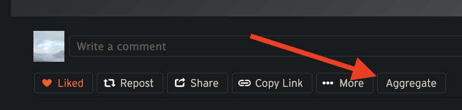
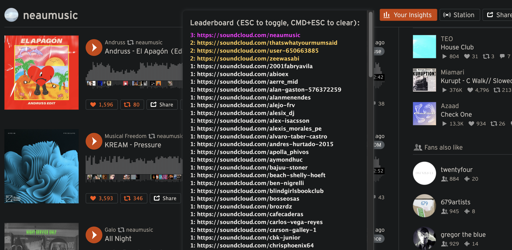

Install
--

https://github.com/neaumusic/soundcloud-radar/releases

Download and open the .zip, go to `chrome://extensions` and "Load Unpacked" to target the folder

Summary
--

Finds and tallies people who reposted chosen tracks

Adds an "Aggregate" button to tally users onto a leaderboard

Development
--

- Install homebrew (https://brew.sh)
- run `brew install yarn`
- run `yarn` or `yarn watch` in this folder
- `chrome://extensions` → Load Unpacked → `dist/`
